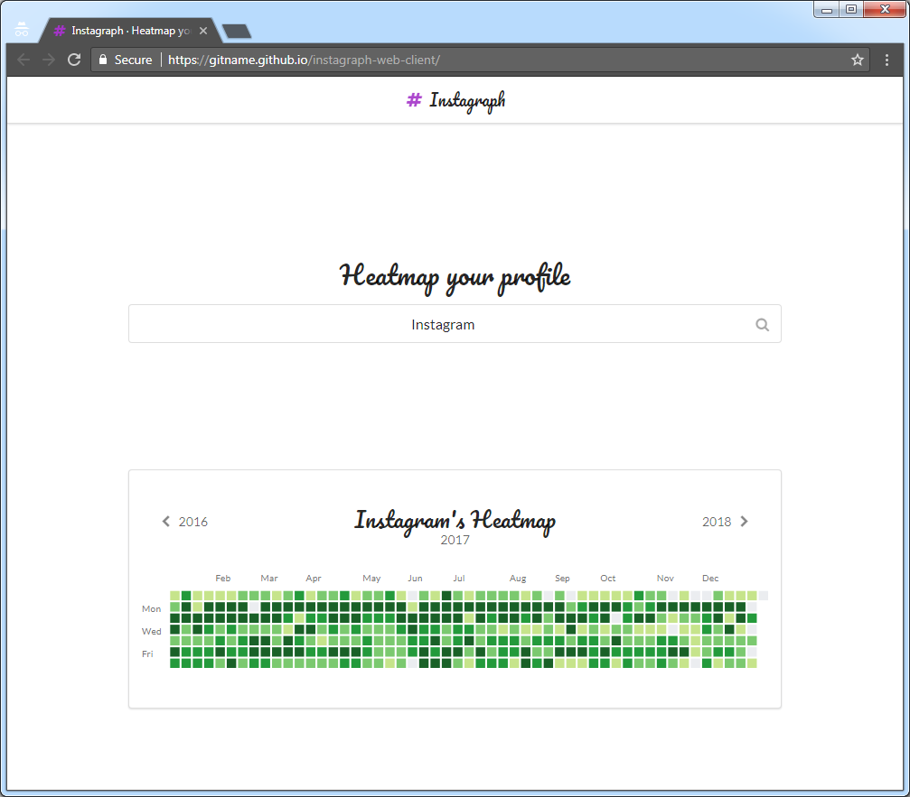

# Instagraph Web Client

## Introduction

Instagraph Web Client is a web application people can use to visualize their Instagram post history.

It features a **calendar heatmap** that shows how many public posts an Instagram user made on each day of the year.

## Screenshot

## Technologies

Instagraph Web Client was built using the following technologies:

* React (via [`create-react-app`](https://github.com/facebookincubator/create-react-app))
* [React Calendar Heatmap](https://github.com/patientslikeme/react-calendar-heatmap)
* Redux
* Redux Form
* Redux Thunk
* Semantic UI
* Fetch API
* Promise API
* Instagram HTTP API
* Jest
* ECMAScript 2015/ES6

## Features

Instagraph Web Client has the following features:

* **Interactive Calendar Heatmap**: When the visitor hovers over a date in the heatmap, the heatmap displays a tooltip containing information about that date
* **Client-Side Cache**: After the web application fetches data from the internet, it caches that data locally (i.e. on the client side). Then, whenever the visitor's actions necessitate the retrieval of the same data, the web application retrieves it from the cache instead of from the internet 
* **Loading Indicator**: While the web application fetches data from the internet, it displays a loading animation
* **Redux DevTools Extension Support**: Curious visitors can monitor the dispatching of Redux actions and examine their contents, by using the [Redux DevTools Extension](https://chrome.google.com/webstore/detail/redux-devtools/lmhkpmbekcpmknklioeibfkpmmfibljd) for Google Chrome 
* **HTTP API Utilization**: The web application retrieves Instagram post data via the Instagram HTTP API
* **Responsive Layout**: The layout of the page automatically adjusts itself to accommodate screens of various widths (e.g. desktop and mobile)

## Limitations

Instagraph Web Client has the following limitations:

* **Hits Instagram HTTP API Rate Limit**: Instagram limits the number of times a computer can access its HTTP API during a given time period. It is possible—by submitting multiple distinct usernames in rapid succession, for example—to cause this web application to hit that limit on behalf of a visitor's computer. When that happens, the web application will display generic error information on the page and [specific error information](https://tools.ietf.org/html/rfc6585#section-4) in the web browser's JavaScript console. Visitors can recover from that error by refraining from using the web application—and from otherwise accessing Instagram—for several minutes (e.g. 10 minutes).

## Demo
 
You can explore a live version of Instagraph Web Client at the following URL:

https://gitname.github.io/instagraph-web-client/